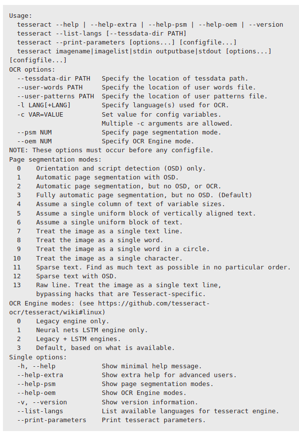

# Optical_Character_Recognition
Implementation of OCR with Google's Tesseract model.Tesseract is an open-source cross-platform OCR engine initially 
developed by Hewlett Packard, but currently supported by Google. 

## 1. Problem Statement: Verify the data on images, e.g. sometimes we need to verify Pancard's or Aadharcard's details.

### Configure Tesseract's parameters

Most of the configs are mentioned in this image but for this project, I have only managed Page segmentation.

### Preprocessing Steps:
Sometimes data on production is very noisy and preprocessing exactly help here to 
achieve better accuracy.
1. Image Processing techniques used in OCR for ID cards.
   1. img = cv2.resize(img, None, fx=1.5, fy=1.5, interpolation=cv2.INTER_CUBIC)
   2. img = cv2.cvtColor(img, cv2.COLOR_BGR2GRAY)
   3. img = self.adjust_gamma(img, gamma=1)
   4. img, _ = restoration.unsupervised_wiener(img, psf) 
   5. Deskew Image: https://becominghuman.ai/how-to-automatically-deskew-straighten-a-text-image-using-opencv-a0c30aed83df 
   6. Adjust Gamma
     Gamma values < 1 will shift the image towards the darker end of the spectrum while gamma values > 1 will make the image appear lighter. A gamma value of G=1 will have no affect on the input image.
     Unsupervised Wiener: https://scikit-image.org/docs/stable/auto_examples/filters/plot_restoration.html#id2
     The inverse filter based on the PSF (Point Spread Function), the prior regularisation (penalisation of high frequency) and the tradeoff between the data and prior adequacy. The regularization parameter must be hand tuned.

2. EAST: An Efficient and Accurate Scene Text Detector
  It is mainly used to localize the text, so we can pass it to Tesseract model for better results.

### Output:
